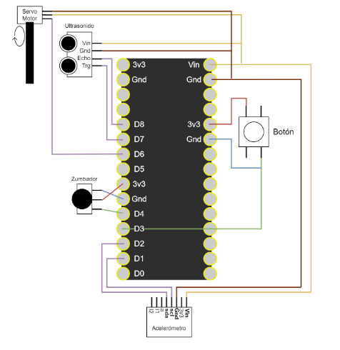
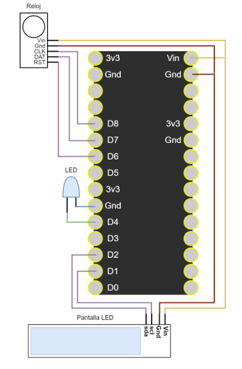
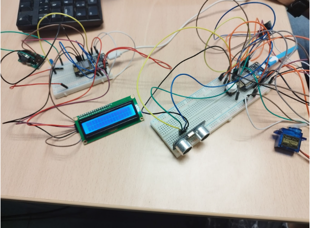

# SecurityBox
## Security system for a safe implemented in arduino

Practical project for the subject Embedded and Ubiquitous Systems of the Master in Computer Engineering of the University of Jaén.
Work developed by the group formed by Rubén Cámara Rico, José Carpio Blanca and Pablo Latorre Hortelano.

## System description
The main function of the system is to control access to a safe, alerting the owner of the safe of unauthorized access. For this purpose, a system consisting of two NodeMCU boards has been designed, where one acts as a client and the other as a server, communicating through an access point.
In order to achieve the specific objectives proposed, our system fulfills the following functionalities:

* Communication between boards: the client board must be able to communicate with the server board through a Wifi access point. This communication is crucial for the coordination of the sensors and actuators distributed in the system.
* User interface: The user can send the key to the system through an accessible web interface. This functionality allows easy and secure interaction with the safe, providing an additional layer of security.
* Alarm system: Once the safe receives the correct authorization key, the alarm system is deactivated, ensuring that only authorized access can deactivate the alarms.
* Automatic locking: If an unauthorized access level is detected and the safe is opened, the safe will immediately lock and the alarm will sound to alert the owner and deter the intruder. 
* Convenient owner access: The owner can open and use the safe at his convenience as long as the access level is authorized. This access remains active until the safe is re-locked.
* Tamper detection: If it is detected that the safe is being tampered with, the system will immediately activate the alarm.
* Event Logging: The system stores the date and time of the last authorized access to the safe.
* Feedback: The system shows the user when the access level is authorized, using visual indicators such as LEDs and on-screen messages.

## List of elements used
* Actuators
  * Servomotor
  * LED
  * LiquidCrystal display
  * Buzzer
* Sensors
  * Ultrasound
  * Button
  * Accelerometer
  * Clock and calendar
* Others
  * NodeMCU Board (x2)
  * Protoboard (x2)
  * Cables
  * USB-MicroUSB cables (x2)
  * Wifi access point

## Schematic diagram for the corresponding board with the code Sensores

  

## Schematic diagram for the corresponding board with the code Server

  

## Final system

  

